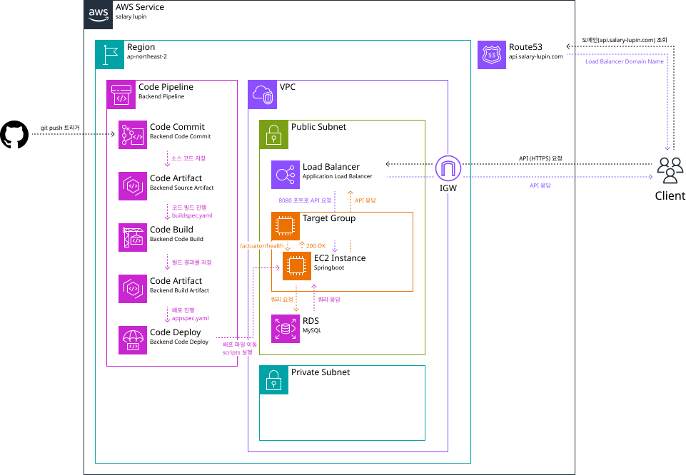

**Salary Lupin은 ‘일하지 않기 위해 일하는’ 사람들을 위한 플랫폼입니다.**

[🔗 웹 사이트 바로가기](https://www.salary-lupin.com)

<br>

## ✨ 프로젝트 개요

본 레포지토리는 Salary Lupin 애플리케이션의 백엔드를 담당하는 **Spring Boot 기반의 REST API 서버**입니다.

[프론트엔드](https://github.com/geist9110/salary-lupin-fe)
와 [인프라](https://github.com/geist9110/salary-lupin-infra)는 별도의 저장소에서 관리됩니다. \
백엔드 서버는 해당 인프라 위에서 동작하며, 프론트엔드와 **HTTP 통신**을 통해 데이터를 주고받습니다.

<details>
<summary>디렉토리 설명</summary>

| 디렉토리                                        | 설명                         |
|---------------------------------------------|----------------------------|
| `scripts`                                   | 배포 자동화 용 쉘 스크립트            |
| `src/docs/asciidoc`                         | Spring REST Docs용 문서 정의 파일 | 
| `src/main/java`                             | 주요 비즈니스 로직이 포함된 Java 코드    |
| `src/main/com/salarylupin/server/global`    | 공통 응답 포맷 및 글로벌 설정 관련 클래스   |
| `src/main/com/salarylupin/server/magicbook` | 마법의 고민해결 책 기능 관련 클래스       |
| `src/main/resources`                        | 설정 파일과 정적 리소스              |
| `src/test/java`                             | 백엔드 테스트 코드를 구성하는 디렉토리      |
| `src/test/java/com/salarylupin/server/unit` | 유닛 테스트 코드가 위치한 디렉토리        |

</details>

<br>

## ⭐️ 주요 기능

### 마법의 고민 해결 책

> 고민이 있을 때, **마법의 고민 해결 책**이 당신에게 답변을 제공합니다.

<br>

## 🛠️ 기술 스택

| 분류         | 기술 스택                                           |
|------------|-------------------------------------------------|
| **언어**     | Java 21                                         |
| **프레임워크**  | Spring Boot 3.4.5 (Web MVC, Data JPA, Actuator) |
| **데이터베이스** | MySQL, H2                                       |
| **빌드**     | Gradle                                          |
| **문서화**    | Spring REST Docs                                |
| **유틸리티**   | Lombok                                          |
| **컨테이너**   | Docker                                          |
| **CI/CD**  | AWS CodeBuild, AWS CodeDeploy                   |

<br>

## 🧱 서버 인프라



<br>

## 📦 환경 변수

애플리케이션은 `application.yaml`을 통해 설정되며, 프로파일별로 환경을 관리합니다. \
운영 환경에서는 필수 환경 변수들이 `SSM`과 `Secrets Manager`를 통해 설정됩니다.

| 변수명         | 설명               | 예시                                       | 필수 |
|-------------|------------------|------------------------------------------|----|
| DB_URL      | 데이터 베이스 경로       | jdbc:mysql://localhost:3306/salary-lupin | ✅  |
| DB_USERNAME | 데이터 베이스 사용자 이름   | root                                     | ✅  |
| DB_PASSWORD | 데이터 베이스 사용자 패스워드 | password                                 | ✅  |
| ORIGINS     | CORS 허용을 위한 URL  | http://localhost:5173                    | ✅  |

<br>

## ⚙️ 프로젝트 빌드 및 실행

### 프로젝트 빌드

Gradle로 Java 코드 컴파일, 테스트, JAR 파일 생성을 수행합니다.

```bash
./gradlew clean build
```

### 로컬에서 실행

환경 변수 설정 후 8080 포트에서 애플리케이션을 실행합니다.

```bash
./gradlew bootRun
```

### 테스트 실행

src/test/java/의 모든 테스트를 H2 인메모리 DB 기반으로 실행합니다.

```bash
./gradlew test
```

### API 문서 확인

빌드 후 `build/docs/asciidoc/index.html`에서 Spring REST Docs 기반 API 문서를 확인할 수 있습니다.

<br>

## 🚀 배포

### Docker를 통한 컨테이너화

로컬 환경에서 **AWS EC2 t2.micro 인스턴스와 유사한 리소스 제한**을 적용하여 애플리케이션의 성능 및 부하 테스트를 수행할 수 있습니다.

```bash
./gradlew build 
docker build -t salary-lupin-backend:latest .
docker run -d --name EC2_SalaryLupinServer \
              -e SPRING_DATASOURCE_URL=jdbc:mysql://host.docker.internal:3306/salary-lupin \
              -m 1g \
              --memory-swap 1g \
              --cpu-period 100000 \
              --cpu-quota 50000 \
              -p 8080:8080 \
              --rm \
              salary-lupin-backend:latest
```

<br>

### CI/CD

**AWS CodeBuild** 및 **AWS CodeDeploy**를 통한 배포 자동화 파이프라인이 구축되어 있습니다.

#### AWS CodeBuild

`buildspec.yml`을 통해 빌드 환경을 설정하고, `./gradlew build`로 JAR 파일을 생성합니다. \
`SPRING_PROFILES_ACTIVE=prod`를 활성화하고 Java 21환경을 구성합니다. \
이후 `app.jar`, `scripts/**/*`, `appspec.yml`을 아티팩트로 패키징합니다.

#### AWS CodeDeploy

빌드 아티팩트를 EC2 인스턴스에 복사하며 배포 과정을 관리합니다. \
`appspec.yml`은 배포 수명 주기 훅(Lifecycle Hooks)을 정의하여 자동화된 배포를 수행합니다.

1. `ApplicationStop` \
   기존 앱 중지(`scripts/stop.sh`)
2. `BeforeInstall` \
   Java 21 및 필요 디렉토리 설정(`scripts/init.sh`)
3. `ApplicationStart` \
   SSM/SecretManager를 통한 환경 변수 주입 및 `nohup`으로 앱 시작 (`scripts/start.sh`)